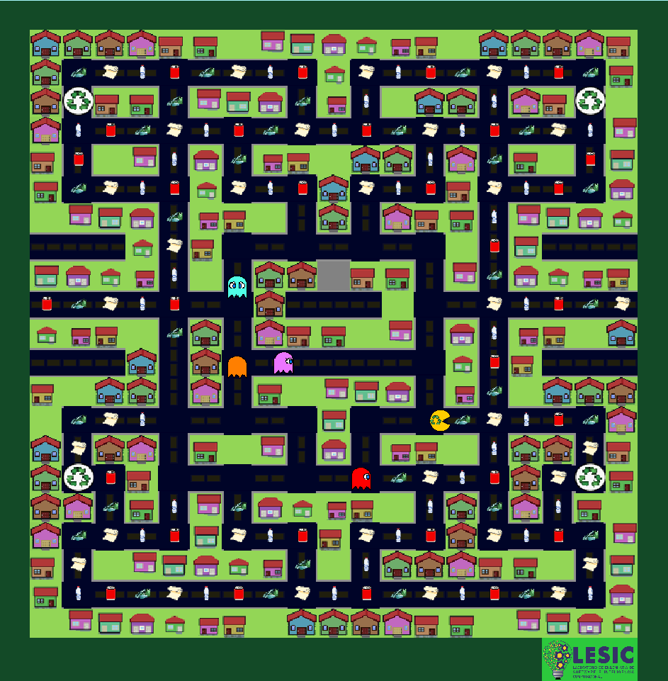

# Ajudando a Reciclar (Pac-clone)

Ajudando a Reciclar é um jogo inspirado em quase todos os aspectos do jogo Pac-man.
Ele foi feito para um projeto universitário na matéria da Inteligência Artificial.

Sua ideia é ser um jogo educativo desenvolvido com o tema de cidades inteligentes,
mais especificamente a reciclagem.

## Ilustração 

Para saber do que se trata aqui um exemplo de um nível.

